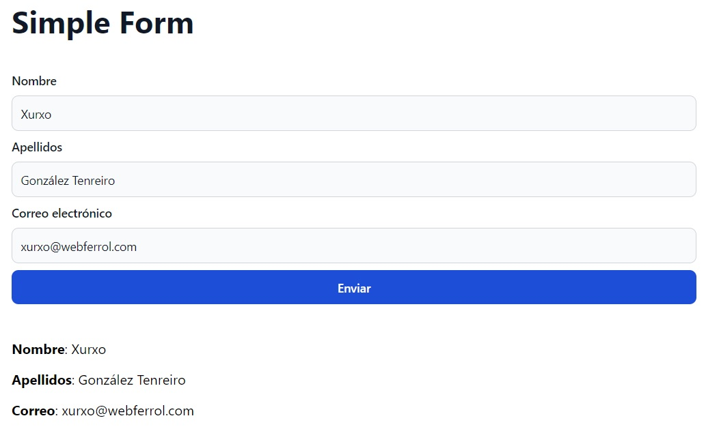
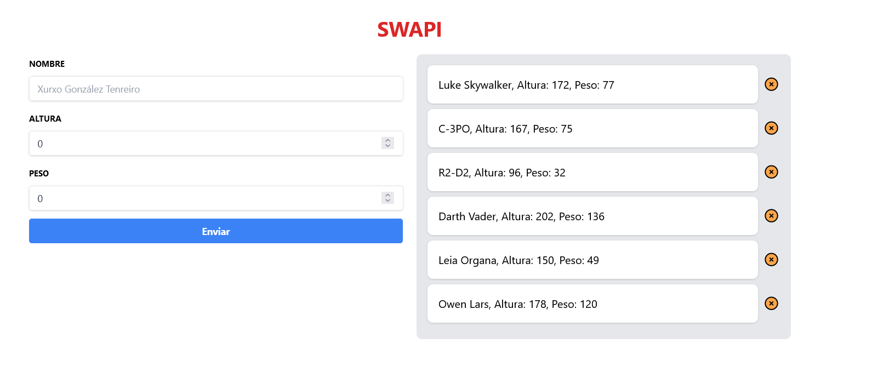

# React

[Invitación a Classroom](https://classroom.google.com/c/NTg0NTY4MTAxMTg4?cjc=eyufnhy)

## JavaScript imprescindible

### import / export

1. Exportación: primitivos, no primitivos, funciones

```js
export let variable_name
export function function_name() {
  // Statements
}
export const USUARIO = { name: 'Xurxo', edad: 50 }
```

2. Exportación por defecto

```js
export default function app () {
    // Statements
}
```

3. Importaciones (nombradas y por defecto)

```js
import miApp, { variable_name, USUARIO, function_name } from 'path_to_file'
```

### Destructuring

```jsx
const YO = { 
  nombre: 'Xurxo',
  apellido1: 'González',
  apellido2: 'Tenreiro'
}

// Desetructuración de un "Objeto Literal"
const { nombre, apellido1, apellido2 = 'Desconocido' } = YO

```

La __desestructuración__ la utilizamos siempre aunque a veces no nos demos cuenta. Por ejemplo cuando desestructuramos las __props__ de un componente:

```jsx
function MiApp ({ value }) {
  return (<div>{value}</div>)
}
```

También podemos _desestructurar_ un __array__:

```jsx
const numeros = [1, 2, 3]

const [num1, num2, num3] = numeros
```
### Búsqueda en arrays

Sólo algunos ejemplos:

- [Array.prototype.indexOf()](https://developer.mozilla.org/es/docs/Web/JavaScript/Reference/Global_Objects/Array/indexOf)
- [Array.prototype.includes()](https://developer.mozilla.org/es/docs/Web/JavaScript/Reference/Global_Objects/Array/includes)
- [Array.prototype.some()](https://developer.mozilla.org/es/docs/Web/JavaScript/Reference/Global_Objects/Array/some)
  
### Fetch

Para obtener datos de un servidor donde el __end point__ es una __API Rest__

- [fetch](https://developer.mozilla.org/es/docs/Web/API/fetch)

__fetch__ es un __método__ del objeto global (en caso del navegador sería __window__) que lanza una petición de un recurso de red. Lo que devuelve es una promesa.

```js
Promise<Response> fetch(input[, init]);
```

En el ejemplo que veremos a continuación el __input__ será un __string__ que representa la localización del recurso de red que deseamos obtener. En este caso un fichero plano __json__ que posteriormente lo convertiremos en un __objeto javascript__ con el método __json()__

```js
fetch('https://swapi.dev/api/people/1')
  .then(response => response.json())
  .then(data => console.log(data))
```

Existe también otra alternativa de lanzar fetch a través de una función asíncrona

```js
async function getPeople () {
  const response = await fetch('https://swapi.dev/api/people/1')
  const data = await response.json()
  console.log(data)
}
```

### Promesas

Una __promesa__ en Javascript (también conocida como __Promise__ en inglés) es un __objeto__ que representa un valor que puede estar disponible ahora, en el futuro, o nunca. 

Una promesa se utiliza para trabajar con __tareas asíncronas__ de manera más sencilla y legible que utilizando callbacks, ya que permite trabajar con resultados futuros como si fuesen datos presentes. 

Las promesas tienen tres estados posibles:

- **Pendiente (pending)**: estado inicial de la promesa, antes de que se resuelva o se rechace.
- **Cumplida (fulfilled)**: cuando la promesa se resuelve con éxito y se devuelve un valor.
- **Rechazada (rejected)**: cuando la promesa falla y se devuelve un error.

Las promesas tienen dos métodos principales:

- **then()**: se utiliza para manejar la resolución de la promesa. Pueden encadenarse múltiples llamadas `then()` si es necesario.

- **catch()**: se utiliza para manejar el rechazo o el error que se produce si la promesa falla.

Aquí hay un ejemplo de una función que devuelve una promesa en Javascript:

```javascript
function promesaEjemplo() {
  return new Promise((resolve, reject) => {
    // Simulemos una tarea asíncrona
    setTimeout(() => {
      const exito = true; // cambiar a false para simular un error
      if (exito) {
        resolve("La promesa se resolvió con éxito.");
      } else {
        reject("La promesa falló.");
      }
    }, 2000);
  });
}
```

En este ejemplo, la función `promesaEjemplo()` devuelve una nueva promesa que se resuelve después de simular una tarea de dos segundos. Si `exito` es verdadero, la promesa se resuelve con un valor; de lo contrario, la promesa se rechaza con un error.

Para consumir la promesa, se puede llamar a la función `then()` y `catch()` para manejar la resolución o el rechazo de la promesa, respectivamente:

```javascript
promesaEjemplo()
  .then((resultado) => {
    console.log(resultado); // muestra "La promesa se resolvió con éxito."
  })
  .catch((error) => {
    console.error(error); // muestra "La promesa falló."
  });
``` 

En el caso anterior, debido a que `exito` es verdadero, la promesa se resuelve con éxito, por lo que el valor "La promesa se resolvió con éxito." se muestra en la consola.

Otro ejemplo: 

```js
let num1 = 8
let num2 = 1
const dividir = (dividendo, divisor) => {
  if (divisor === 0)
    return false
  else return dividendo / divisor
}
const sumar = new Promise((resolve, reject) => {
  setTimeout(()=>{
    if (dividir(num1,num2)!==false) resolve(dividir(num1,num2))
    else reject('No es posible dividir por 0')
  },3000)
})

sumar
  .then(console.log)
  .catch(console.error)
```

### Array.prototype.map

> El método map() crea un nuevo array con los resultados de la llamada a la función indicada aplicados a cada uno de sus elementos.
> <cite>[Mozilla Docs](https://developer.mozilla.org/es/docs/Web/JavaScript/Reference/Global_Objects/Array/map)<cite>

__IMPORTANTE__: Los resultados de cada __iteración__ se deben __retornar__.

```jsx
var numbers = [1, 5, 10, 15]
var doubles = numbers.map(function (x) {
   return x * 2; // AQUÍ EL RETORNO
})
// doubles is now [2, 10, 20, 30]
// numbers is still [1, 5, 10, 15]
```

Para __renderizar listas__ a través de expresiones son perfectas. Ejemplo de [react.dev](https://es.react.dev/learn#rendering-lists):

```jsx
const products = [
  { title: 'Cabbage', id: 1 },
  { title: 'Garlic', id: 2 },
  { title: 'Apple', id: 3 },
]

function ProductsApp () {
  const listItems = products.map(product =>
    <li key={product.id}>
      {product.title}
    </li>
  )

    <ul>{listItems}</ul>
  return (
  )
}
```


## React. ¿Qué es?

Como indica su [página oficial](https://es.react.dev/) se trata de una __biblioteca__ o __librería__ para la creación de __interfaces__ des usuario _web_ y _nativas_.

No es más que una  __librería nativa de JavaScript__ que nos facilita el trabajo a la hora de __renderizar__ código, trabajar con __estados__ y mucho más.

## Librerías de React

Para trabajar con __reactjs__ son imprecindibles dos __dependencias__

```js
import React from 'react'
import ReactDOM from 'react-dom/client'
```

Estas serán colocadas en el __entry point__ de nuestro proyecto. Por ejemplo en __vitejs__ sería __main.jsx__

## Functional Component

En __react__ los __componentes__ son __funciones__ que retornan un __elemento react__ y no un __elemento del DOM__

```jsx
/*
 * Function Component
 * @return {React.Element} ¡No retorna un DOM.Element'
*/
function XurxoApp () {
  return (<>Soy Xurxo</>)
}
```

## Impresión de expresiones (variables, constantes, literales, objetos, retorno de funciones ....)

Un __componente react__ siempre retorna una __etiqueta de marcado__. Pero estas marcas no son __JavaScript__

```jsx
  return (<h1>Hola</h1>)
```

Si deseamos escribir JavaScript puro entre estas marcas o sea utilizar __expresiones__, en __React__ se deben utilizar las llaves de apertura y cierre: __{expresión}__. Mira el siguiente __Functional Component__:

```jsx
function Saludar () {
  const nombre = 'Xurxo'
  return (
    <h1>Hola {nombre}</h1>
  )
}
```

## Props

Las __props__ son las _propiedades_ de un __componente__. Son datos que se pasan de un componente padre a un componente hijo. Por ejemplo, si tienes un componente Button que muestra un botón, puedes pasarle una __prop__ text para que el botón muestre ese texto:

```jsx
function Button(props) {
  return <button>{props.text}</button>
}
```

Debe considerarse además que al usar cualquier expresión _JavaScript_ dentro de _JSX_ debe envolverlos con _{}_, en este caso el objeto __props__, de otra forma _JSX_ lo considerará como texto plano. En el ejemplo anterior podemos lanzar el __componente__:

```jsx
<>
  {/* Pasamos un valor de tipo string */}
  <Button text='1' />
  {/* Pasamos un valor de tipo number */}
  <Button text={1} />
</>
```

## Responder eventos

```jsx
function MyButton() {
  function handleClick() {
    alert('You clicked me!');
  }

  // ¡Nota que onClick={handleClick} no tiene paréntesis al final! No llames a la función manejadora de eventos
  return (
    <button onClick={handleClick}>
      Click me
    </button>
  );
}
```

## Hooks

Los __hooks__ son una _API de React_ que nos permite __tener estado__, y otras características de React, en los componentes creados con una function.

Un __hook__ es gancho y, precisamente, lo que hace, es que te _permiten enganchar tus componentes funcionales a todas las características que ofrece React_.

### useStates

A menudo, querrás que tu __componente__ _recuerde_ alguna información y la muestre. 

El _hook_ __useState__ es utilizado para __crear variables de estado__, quiere decir que su valor es __dinámico__, que este _puede cambiar_ en el tiempo y eso requiere una re-renderización del componente donde se utiliza.

```js
const [count, setCount] = useState(0);
```
En el ejemplo de arriba el _hook_ __useState__:

1. Recibe un parámetro:
  - El valor inicial de nuestra variable de estado.
2. Devuelve un _array_ con dos variables:
  - En primer lugar tenemos la variable que contiene el valor.
  - La siguiente variable es una __función set__, requiere el nuevo valor del estado, y este modifica el valor de la variable que anteriormente mencionamos.

```jsx
import { useState } from 'react';

function MyButton() {
  const [count, setCount] = useState(0);

  function handleClick() {
    setCount(count + 1);
  }

  return (
    <button onClick={handleClick}>
      Clicked {count} times
    </button>
  );
}
```
### useRef

__useRef__ es un Hook de React que te permite referenciar un valor que no es necesario para el renderizado.


```jsx
import { useRef } from 'react'

function EjemploRef ({ initialValue }) {
  const myRef = useRef(initialValue)

  return (
    <input
      ref={myRef} 
      type='text'
    />
  )
}
```
#### Solución a problemas

- [No puedo obtener una ref a un componente personalizado](https://es.react.dev/reference/react/useRef#i-cant-get-a-ref-to-a-custom-component)
- [Ejemplo implementado](./components/CustomInput.jsx)

### useId

__useId__ es un Hook de React para generar IDs únicos que se pueden pasar a los atributos de accesibilidad.
[Ejemplo implementado](./components/CustomInput.jsx)

### useContext

La utilización de este __hook__ va emparejado con el método __createContext__ de __React__ que prepara un componente funcional (un entorno o contexto de trabajo) para todos sus componentes funcionales descendientes (__children__). Este contexto nos permite almacenar información (variables) y métodos de trabajo (funciones) que evitan la utilización de __props__ para la comunicación padre hijo o el tan temido prop drilling.

  El __Prop__ Drilling es una paso del desarrollo que ocurre cuando necesitamos obtener datos que están en varias capas en el árbol de componentes React. [Más información](https://es.react.dev/learn/passing-data-deeply-with-context#the-problem-with-passing-props)

👁️👁️👁️ No sustituye las variables de estado generados con __useState__. Simplemente se trata de un modo de comunicación entre los componentes. Fíjate en el siguiente código:

```js
const ThemeContext = createContext('light');
```
Este valor __light__ nunca cambia. React solo usa este valor como respaldo si no puede encontrar un proveedor coincidente arriba.

Para hacer que el contexto cambie con el tiempo, __agrega estado__ y envuelve los componentes en un proveedor de contexto. Ejemplo:

```js
function MyPage() {
  const [theme, setTheme] = useState('dark')
  return (
    <ThemeContext.Provider value={theme}>
      <Form />
      <Button onClick={() => {
        setTheme('light')
      }}>
        Cambiar a tema claro
      </Button>
    </ThemeContext.Provider>
  );
}
```


## Memo

__memo__ te permite saltarte el rerenderizado de un componente cuando sus props no han cambiado.
Esto obviamente sólo será necesario si notamos una merma de rendimiento en uno de nuestros componenentes por realizar por ejemplo procesos pesados.

Elemplo de aplicación:

```jsx
const MovieItem = memo(({ title }) => {
  console.log('MoviItem :)')
  return (
    <div>{title} - {Math.floor(Date.now() / 1000)} seg</div>
  )
})
```
- [Ejemplo completo del extracto del código de arriba](./components/Memo.jsx)
- Para ver ejemplos de uso ir a la documentación de react para la utilización del [método memo](https://es.react.dev/reference/react/memo).

## Ejemplo de gestión de un formulario

```js
import React, { useState } from 'react'

export function ExperiencePage () {
  const [nombre, setNombre] = useState('')
  const [apellidos, setApellidos] = useState('')

  const handleNombre = e => {
    // e.target.value
    const { target } = e // Desestructuro
    setNombre(target.value)
  }

  const handleApellidos = e => {
    setApellidos(e.target.value) // No desestructuro
  }

  const handleSubmit = e => {
    e.preventDefault() // Paramos envío de formulario
    // A partir de aquí lo que queramos: cargar un array, login, guardar en BBDD
  }

  return (
    <form onSubmit={handleSubmit}>
      <legend>Info de {nombre} {apellidos}</legend>
      <div>
        <label htmlFor='nombre'>Nombre</label>
        {/* value es una props y de sólo lectura para solucionarlo método onChange */}
        <input
          type='text'
          name='nombre'
          id='nombre'
          value={nombre}
          onChange={handleNombre}
        />
      </div>
      <div>
        <label htmlFor='apellidos'>Apellidos</label>
        <input
          type='text'
          name='apellidos'
          id='apellidos'
          value={apellidos}
          onChange={handleApellidos}
        />
      </div>
      <button>Enviar</button>
    </form>
  )
}
```

## Ejercicios

1. [x] Crea un Componente botón y renderízalo en tu app

2. [x] Crear un fichero js con un __objeto literal__ con la información de tu nombre, apellidos y edad. Expórtalo y muestra los resultados en tu __app__

3. [x] 
  - [Una solución](https://github.com/webferrol/react-counter-project.git)

4. [x] 
  - [Una solución](https://github.com/webferrol/react-simple-form.git)

5. [x] 
  - [Una solución](https://github.com/webferrol/react-swapi)

6. [x] Github Avatar y Todo List
  - [Una solución](https://github.com/webferrol/react-github_avatar-todolist)


  # Proyecto

  - [Proyecto de portafolio](https://github.com/webferrol/react-portfolio)
